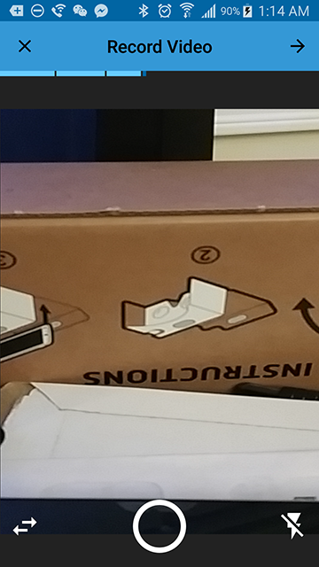
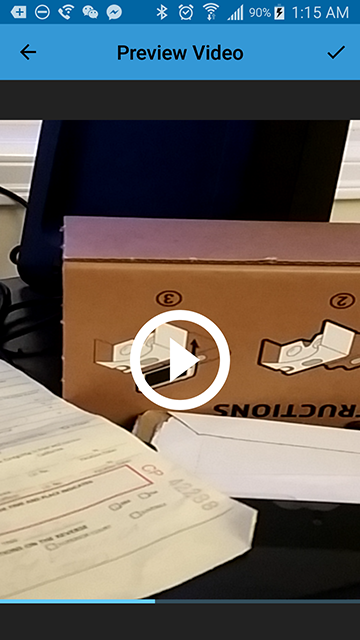
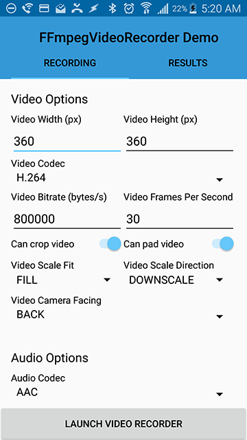
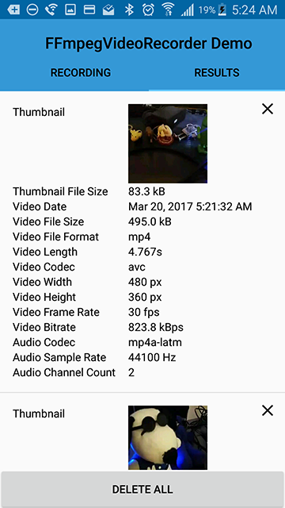

# FFmpegVideoRecorder - Customizable Video Recording Library for Android

The library provides a way to record multiple videos using MediaRecorder and merge them together
using FFmpeg Recorder from JavaCV. It is designed to allow maximum customization of the video
encoding and recording.

It has built in activities for easy recording and previewing. But it also exposes basic components
that can be used to customize your own UI and logic.

## Features

### General

- Able to record multiple clips and combine them into one video
- Camera preview image is scaled, cropped, and padded to exactly how it will be recorded
- Can generate a thumbnail image for the video
- Can set recording parameters such as:
    - video codec
    - video width
    - video height
    - video frame rate
    - video bitrate
    - video scaling
    - video image fit
    - video cropping
    - video padding
    - audio codec
    - audio bitrate
    - audio channel count
    - audio sampling rate
- Can set interaction parameters such as:
    - min and max recording time
    - max file size
    - tap to focus duration
    - tap to focus size
- Can set theme colors parameters

### Components

All components are designed to be extensible and usable without all the other components. Some of
the main components:

#### CameraController

Wrapper for camera library that abstracts away some of the complications about checking support
for various features.

#### CameraPreviewView

SurfaceView that scales and crops the view so that it matches the desired resolution.

#### MediaClipsRecorder

Recorder that simplifies logic for recording multiple video clips.

#### VideoTransformerTask

Task that combines multiple video files and transforms the video frames into the desired resolution.

#### FFmpegRecorderActivity

Activity that allows the user to record videos in a way similar to instagram and snapchat

- Dynamically customize the color of the actionbar and widgets 
- Enable / disable flash
- Switch between front and back cameras
- Instagram / Snapchat like recording by holding down a button



#### FFmpegPreviewActivity

Activity to preview the recorded video before selecting the video



## Limitations

- Video width must be a multiple of 2, so the recorded video might not be in the exact dimensions requested.

## Demo

There is a demo activity that allows you to try different settings for recording videos.

 

## Installation

[ ](https://bintray.com/amosyuen/maven/FFmpegVideoRecorder/_latestVersion)

### Gradle

```
compile 'com.amosyuen.ffmpegvideorecorder:ffmpeg-video-recorder:2.0.2'
```

### Maven

```
<dependency>
  <groupId>com.amosyuen.ffmpegvideorecorder</groupId>
  <artifactId>ffmpeg-video-recorder</artifactId>
  <version>2.0.2</version>
  <type>pom</type>
</dependency>
```

### Ivy

```
<dependency org='com.amosyuen.ffmpegvideorecorder' name='ffmpeg-video-recorder' rev='2.0.2'>
  <artifact name='$AID' ext='pom'></artifact>
</dependency>
```

### Local Checkout

```
git clone git://github.com/amosyuen/FFmpegVideoRecorder.git
```

## Usage

*For a working implementation, please have a look at the demo project*

1. For Android M and above, make sure you request the following permissions before starting the activity:

    - Manifest.permission.CAMERA
    - Manifest.permission.RECORD_AUDIO
    - Manifest.permission.WAKE_LOCK
    - Manifest.permission.WRITE_EXTERNAL_STORAGE

3. Send an intent to start the activity with the desired parameters. The parameters are required:

	```java
	private static final int RECORD_VIDEO_REQUEST = 1000;

    public void startActivity(File videoFile, File thumbnailFile) {
        FFmpegRecorderActivityParams.Builder paramsBuilder =
                FFmpegRecorderActivityParams.builder(getContext())
                        .setVideoOutputFileUri(videoFile)
                        .setVideoThumbnailOutputFileUri(thumbnailFile);
                      
        paramsBuilder.recorderParamsBuilder()
                .setVideoSize(new ImageSize(640, 480))
                .setVideoCodec(VideoCodec.H264)
                .setVideoBitrate(100000)
                .setVideoFrameRate(30)
                .setVideoImageFit(ImageFit.FILL)
                .setVideoImageScale(ImageScale.DOWNSCALE)
                .setShouldCropVideo(true)
                .setShouldPadVideo(true)
                .setVideoCameraFacing(Facing.BACK)
                .setAudioCodec(AudioCodec.AAC)
                .setAudioSamplingRateHz(44100)
                .setAudioBitrate(100000)
                .setAudioChannelCount(2)
                .setOutputFormat(OutputFormat.MP4);
           
        Intent intent = new Intent(this, FFmpegRecorderActivity.class);
        intent.putExtra(FFmpegRecorderActivity.REQUEST_PARAMS_KEY, paramsBuilder.build());
        startActivityForResult(intent, RECORD_VIDEO_REQUEST);
    }
    ```

4. Override `onActivityResult` method and handle request code sent in step 3.

    ```java
    @Override
    public void onActivityResult(int requestCode, int resultCode, Intent data) {
        if (requestCode == RECORD_VIDEO_REQUEST) {
            switch (resultCode) {
                case RESULT_OK:
                    Uri videoUri = data.getData();
                    Uri thumbnailUri =
                            data.getParcelableExtra(FFmpegRecorderActivity.THUMBNAIL_URI_KEY);
                    break;
                case Activity.RESULT_CANCELED:
                    break;
                case FFmpegRecorderActivity.RESULT_ERROR:
                    Exception error = (Exception)
                            data.getSerializableExtra(FFmpegRecorderActivity.ERROR_PATH_KEY);
                    break;
            }
        }
    }
    ```

## Known Issues

### UnsatisfiedLinkError

This error means that the native libraries were not installed properly. One common problem is that
Android doesn't support loading both 64-bit and 32-bit native libraries at the same time.
Unfortunately the FFmpeg library used in this library only has 32-bit binaries. So if your app
includes another dependency that has 64-bit libraries, this will make the app unable to load the
video recorder. The only workaround is to exclude 64-bit native libraries. This can be done by
adding these lines in your app gradle build file:

```
android {
    //...
    packagingOptions {
        exclude "lib/arm64-v8a/**"
        exclude "lib/x86_64/**"
    }
    //...
}
```

## Credits

This library is based off of these sources:

- https://github.com/sourab-sharma/TouchToRecord
- https://github.com/bytedeco/sample-projects/tree/master/JavaCV-android-example

It uses https://github.com/bytedeco/javacv for combining and encoding videos.

